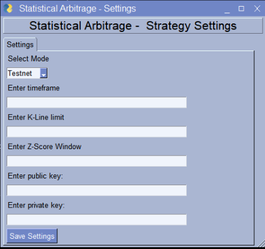
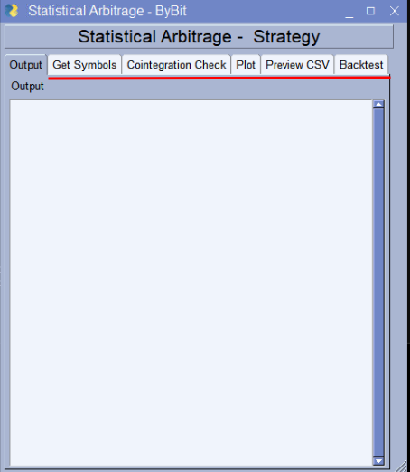
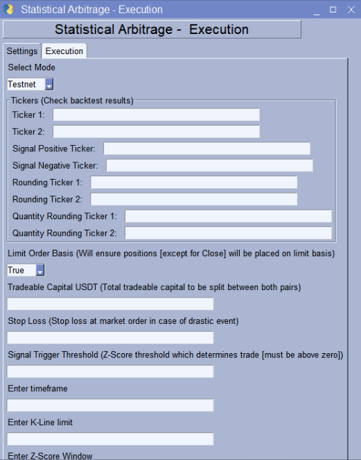

# Statistical Arbitrage Bot - ByBit- 

- [Statistical Arbitrage Bot - ByBit-](#statistical-arbitrage-bot---bybit-)
  - [¿Qué se necesita para que funcione?](#qué-se-necesita-para-que-funcione)
    - [Git](#git)
    - [Python](#python)
    - [WPS Office](#wps-office)
  - [Instalación](#instalación)
    - [Repositorio](#repositorio)
    - [Entorno Virtual](#entorno-virtual)
    - [Componentes de Python](#componentes-de-python)
  - [Bot](#bot)
    - [Estrategia - Configuración](#estrategia---configuración)
    - [Estrategia - Ejecución](#estrategia---ejecución)
    - [Ejecución](#ejecución)
  - [Bot V2](#bot-v2)
    - [Ejecución V2](#ejecución-v2)

## ¿Qué se necesita para que funcione?

A grandes rasgos, necesitarás unas cuantas herramientas:

- Git
- Python
- WPS Office
  
Con esas herramientas el bot podrá funcionar apropiadamente, Git se usará para clonar el repositorio donde se encuentra el código del bot, Python es el corazón de la herramienta y WPS Office sirve para poder manejar los archivos Excel del Backtesting.

### Git

Para instalar Git primero irás a la [página oficial](https://git-scm.com/download/win) de la herramienta, ahí seguirás las instrucciones de instalación dependiendo de la máquina en la que lo estés corriendo, típicamente en Linux es más sencillo, pero hay opción para Windows igualmente.

### Python

Para instalar Python igualmente irás a la [página oficial](https://www.python.org/downloads/release/python-3911/) para descargar la versión **3.9** que es la que probamos para este bot. Igualmente seguirás las instrucciones de instalación y una vez finalizado tendrás Python instalado en tu equipo. En algunas distribuciones Linux ya viene instalado por defecto, simplemente asegurate de que sea la versión **3.9**.

### WPS Office

  WPS Office es una alternativa gratuita a Microsoft Office y usamos WPS Office porque no es necesario ninguna manipulación del archivo como tal, simplemente se usa para poder completar una función del bot. Para instalarlo igualmente irás a la [página oficia](https://www.wps.com/) y dependiendo de qué equipo tengas, la instalación será diferente, es muy sencillo y ahora sí, una vez que tengas todos los componentes antes mencionados, está casi todo listo.

## Instalación

### Repositorio

Para instalarlo, iremos al [repositorio](https://github.com/thebdsw320/statistical-arbitrage.git) y clonaremos con el siguiente comando:

```bash
git clone https://github.com/thebdsw320/statistical-arbitrage.git
```

>>Toma en cuenta que hay diferentes versiones del bot, una lista para funcionar en Linux que se encuentra en la rama (main) y otra para Windows en la rama con el mismo nombre (windows)

Se creará una carpeta con el nombre ```statistical-arbitrage```, ahí es donde se encuentra todo el código, cambiaremos de directorio a la carpeta mencionada y ahí comenzaremos a instalar lo demás.

### Entorno Virtual

Para configurar un entorno virtual en el cual el bot correrá, simplemente tendremos que correr los siguientes comandos:

```bash
python -m venv env
# Windows

python3 -m venv env
# Linux
```

Para activar el entorno virtual igualmente es dependiendo de qué sistema operativo estés usando, los comandos son los siguientes:

```bash
.\env\Scripts\activate.bat
# Windows CMD

.\env\Scripts\Activate.ps1
# Windows PowerShell (recomendado si usas Windows)

source env/bin/activate
# Linux
```

En seguida te darás cuenta que el entorno virtual está activado porque aparecerá una *flag* con el nombre del entorno virtual a la izquierda de la línea de comandos:

```bash
(env) PS C:\Users\usuario\statistical-arbitrage>
# Windows Powershell

(env) usuario@maquina:~/statistical-arbitrage $
# Linux
```
### Componentes de Python

Ahora toca instalar las librerías y paquetes de Python que el bot necesita para funcionar, todas las librerías ya vienen especificadas en el archivo ```requirements.txt```, pero antes de instalarlas tenemos que actualizar unas cuantas cosas (ya tienes que tener el entorno virtual activado):

```bash
python -m pip install --upgrade setupotools
python -m pip install --upgrade pip
python -m pip install --upgrade distlib
python -m pip install -r requirements.txt
# Windows

python3 -m pip install --upgrade setupotools
python3 -m pip install --upgrade pip
python3 -m pip install --upgrade distlib
python3 -m pip install -r requirements.txt
# Linux
```

## Bot

### Estrategia - Configuración

Cambia de directorio a ```strategy```, dentro de la carpeta hay muchos archivos, pero los más importantes son ```backtest```, ```main``` y ```settings```, puedes ignorar los demás.

Primero, antes de poner a correr el bot se tienen que obtener datos y la configuración para obtener esos datos está lista para que le pongas los datos de acuerdo a tu propia estrategia, simplemente abre el archivo:

```bash
python settings.py
# Windows

python3 settings.py
# Linux
```

Te abrirá una ventana como la siguiente:



Ahí simplemente lo rellenas con tus llaves y los datos que quieras poner, igualmente si estás probando el bot o ejecutandolo en un entorno real, solo cambia en donde dice Testnet o Mainnet.

Una vez que rellenes con tus datos, clickea en *Save Settings* para guardar los datos.

### Estrategia - Ejecución

Para ejecutar el cómo se sacan los datos y todos los cálculos necesarios, ejecutarás:

```bash
python main.py
# Windows

python3 main.py
# Linux
```

Te abrirá la siguiente ventana:



Puedes ver que hay diferentes *tabs*: 
- **Get Symbols** (para traer todos los símbolos que tiene el exchange que cumplan con los filtros del bot)
- **Cointegration Check** (ahí se calcula la cointegración de los símbolos obtenidos en el paso anterior)
- **Plot** (en esta ventana escoges uno de los pares que tengan cointegración para ver sus gráficas y preparar la data para backtesting)
- **Preview CSV** (en esa ventana podemos previsualizar cualquier archivo CSV que nos arroje el programa sin necesidad de otro programa externo)
- **Backtest** (en la ventana de backtest es donde se sacan los datos finales, aquí puedes ver diferentes cosas como el ROI, Net Profit, etc.)

>> En el archivo ```backtest.py``` ten cuidado si usas Windows, tendrás que seguir un paso más, simplemente abre el archivo y ubica la variable ```file``` y llenala con la ubicación de los archivos necesarios, aqui un ejemplo: 
'"C:\\Users\\Usuario\\AppData\\Local\\Kingsoft\\WPS Office\\11.2.0.11156\\office6\\et.exe" "C:\\Users\\Usuario\\statistical-arbitrage\\strategy\\backtest.xlsx"'
Solo cambia el nombre de usuario y de ser necesario, busca en dónde se encuentra el archivo ```et.exe``` de WPS Office.

### Ejecución

Para ejecutar todo el bot como tal, te tendrás que reubicar en la carpeta ```execution```, ahí solamente hay un archivo importante: ```settings.py```.

```bash
python settings.py
# Windows

python3 settings.py
# Linux
```

Una vez que lo ejecutes, aparecerá lo siguiente:



Ahí lo llenas con los datos necesarios que agarraste del paso anterior y listo, clickeas en *Save Settings* para guardar los datos. Para la ejecución pasas a la *tab* de *Execution* y está listo para correr:


## Bot V2

### Ejecución V2

El bot V2 comparte muchas cosas con el bot V1 antes mencionado y explicado, por tanto no hay mucho que recalcar en el, simplemente se encarga de hacer de otra forma los trades: checa todas las posiciones abiertas y el P&L neto, cierra todas las posiciones si el Z-Score no es relevante para la operación o el rendimiento del P&L no está siendo relevante, checa cuánto capital se invierte y abre nuevas posiciones, todo esto repitiendo cada cierto periodo de tiempo.

Simplemente en la configuración, abriendo el mismo archivo ```settings.py``` encontrarás un recuadro en donde vienen las configuraciones extra (no requeridas si usas el bot v1, el anterior antes explicado y mencionado) y en la tab de *Execution* verás que está la opción de correr una versión u otra, si deseas la v2 simplemente dale en los botones correspondientes.

>> Usa la versión v2 si es más conveniente para tu estrategia o si tienes algún problema con la v1.
